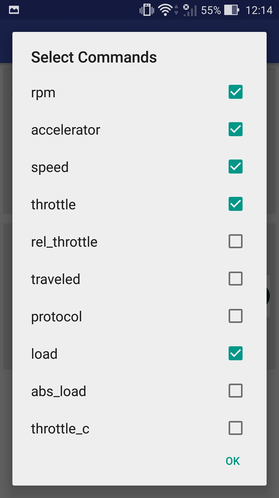
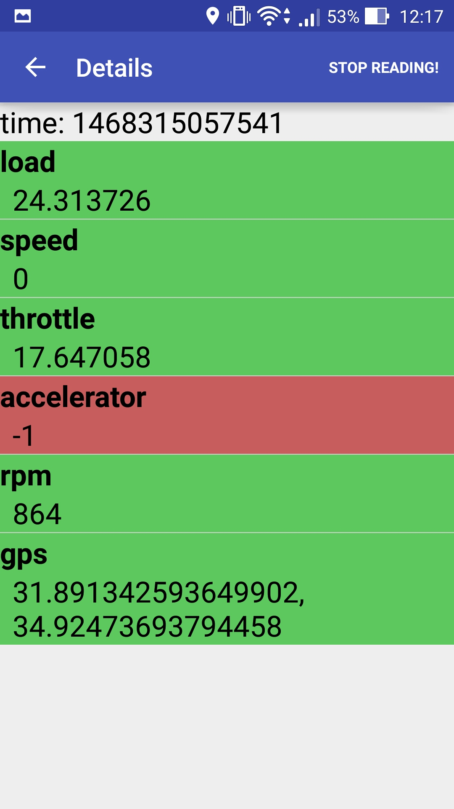
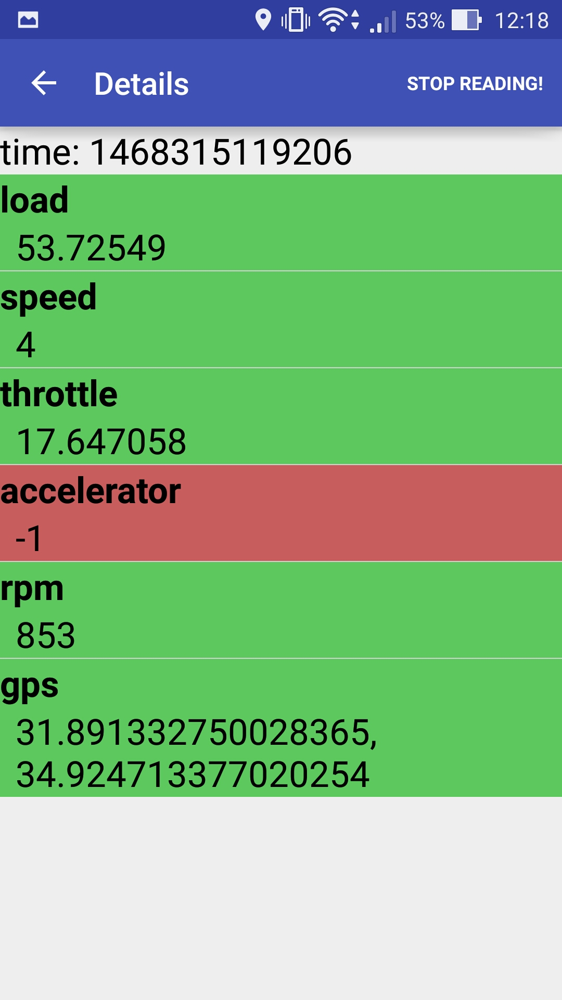
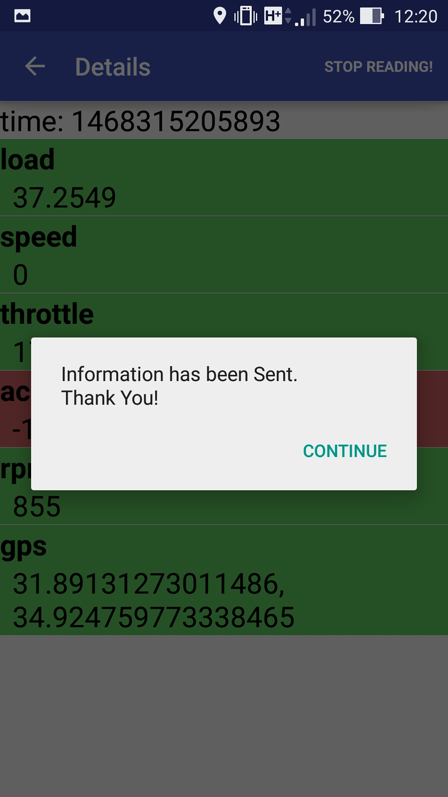
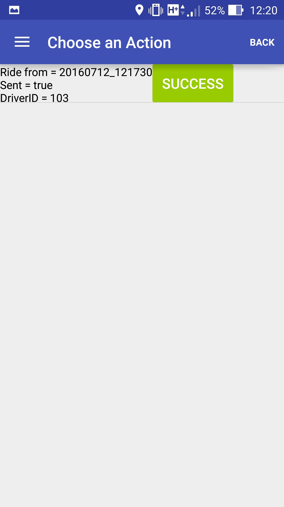
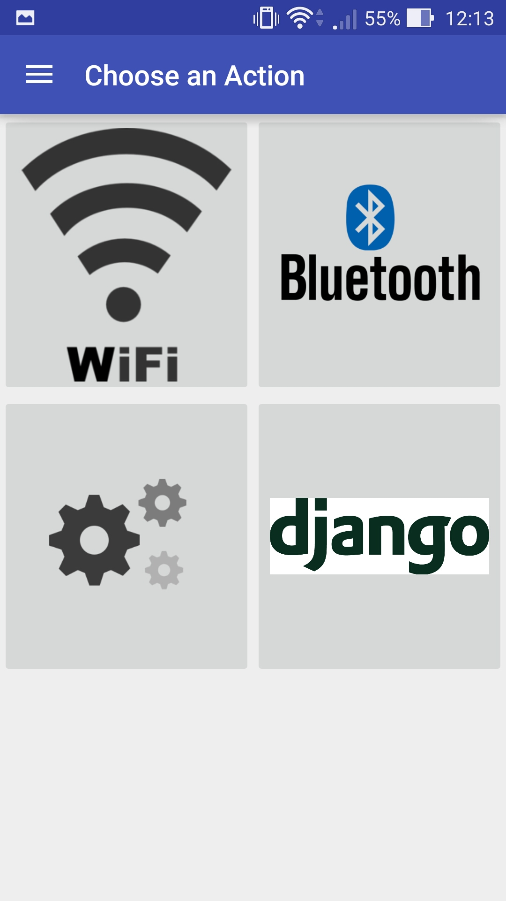
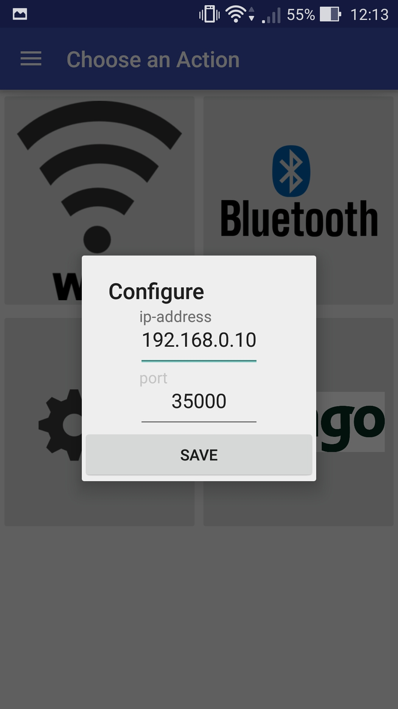
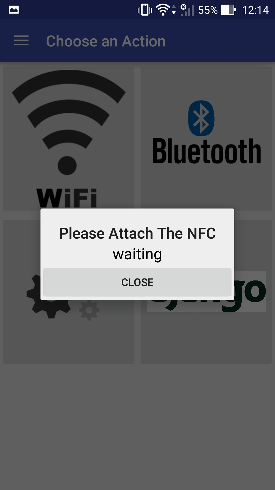

# Flurry
_Collecting drivers driving data for self and academic use_

---

Flurry project helps you to collect data from experimenters using Android application and OBD-II device 

                
[Server](https://github.com/AsafSH6/flurry-server#server)

[Client](https://github.com/mzusman/flurry-client-android#client)

# Client

Highly customizable application, being able to set/change the server's address, Obd-II's address from within the 
application, change the wanted obd commands, choose between wi-fi and bluetooth and support nfc(to bypass login).

##Prerequisites:
- JDK 7+
- Android Studio
- Android SDK (API 19)

###Images:
---
##### Select commands:

##### Running the recorder:

##### Successfully sent:

##### History of the recordings(you're able to send again in case of connection failure):

##### Main page:

##### Change OBD-II's Wi-Fi address:

##### Write tag to a nfc sticker (opens the app without login on attachment with the sticker):

####OBD-II Library in usage -  [OBDII-java-library](https://github.com/pires/obd-java-api)
###Apache License v2

